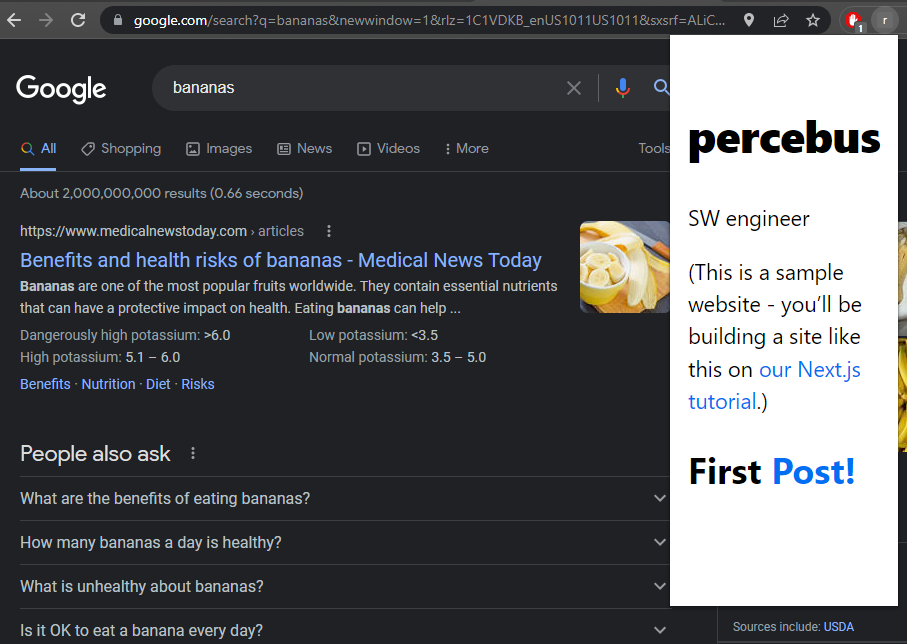

# `react-next-tutorials-jsx-app`

SRC: [nextjs.org/learn/...](https://nextjs.org/learn/basics/create-nextjs-app/)

## History

See [HISTORY.md](./HISTORY.md)

## Setup

### First time

```bash
$> npm run setup
```

### Dependencies

```bash
$> npm install
```

## Development

### R&D

```bash
$> npm run dev
```

## Build

### `dist/`

```bash
$> npm run dist
```

### Package: `out/`

This process creates a standalone version (w/o server-side rendering) that you can host as a SPA anywhere.

```bash
$> npm run pkg
```

Which is mainly `next export` pls some other things

#### `pkg.ba.sh`

This ensures that `./out` is `chrome-extension` friendly.

Mainly, it renames `_next` folder to `next` and all the corresponding references

#### BUG

`sed` does not work in some macOS, mainly due to the version.

See [Install GNU sed on Mac OS and Set It as Default
](https://medium.com/@bramblexu/install-gnu-sed-on-mac-os-and-set-it-as-default-7c17ef1b8f64)

## `chrome-extension`

Similar to our [`react-tic-tac-toe-jsx-app`](https://github.com/percebus/react-tic-tac-toe-jsx-app) ReactJS example, we were able to rapidly make this a `chrome|edge` browser extension by simply adding a [`manifest.json`](./public/manifest.json) inside the [`public/`](./public/) folder

Simply load the generated `out/` folderas an unpacked extension

### `scripts/pkg.ba.sh`

As mentioned above, since this is a browser-side extension, this cannot use NextJS data-fecth features. To accomplish this, we basically.-

```bash
$> next export
```

Which exports the app to a client-side [S]ingle-[P]age-[A]pplication.

And then

```bash
$> find ./out/ -type f -exec sed -i 's/_next/next/g' {} \;
```

Which basically renames `_next` `export`-ed folder to `next`, as `chrome-extenson` does NOT like this. 

### Browsers

#### `chrome`


